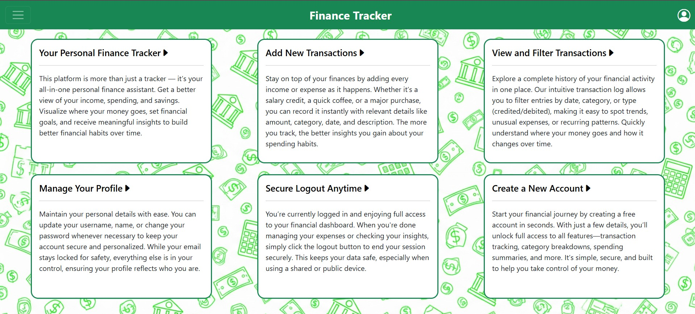

# Personal Finance Tracker



## Overview

The **Personal Finance Tracker** is a full-stack web application designed to help individuals manage their finances in a simple and organized way. Built using **Django** on the backend and **JavaScript** on the frontend, the application enables users to monitor both their income and expenses efficiently.

Users can register and log in to their accounts securely. Once logged in, they can record financial transactions, whether credited (income) or debited (expenses), and assign each transaction to a specific category. This categorization helps in understanding where money is being spent or saved.

The application also features a dynamic dashboard with visual charts powered by Chart.js. These charts display both spending and savings by category and allow users to switch between chart types (bar, pie, etc.) with just a click. Filters are available to view transactions based on category or type, making it easier to analyze financial patterns.

In addition to transaction tracking, users can edit their profile information, including their username, name, and password. The application ensures that the user's session remains active even after a password update.

Responsiveness has been a key focus. The interface has been tested on desktop browsers as well as mobile devices to ensure smooth and intuitive user experience across all screen sizes. The layout is clean and modern, styled using Bootstrap and custom CSS, while external libraries like Chart.js are included via CDN to handle chart rendering without additional setup.

This application serves as a personal financial assistant that’s interactive, responsive, and tailored for individual use, helping users stay in control of their money.


---

## Distinctiveness and Complexity

### Distinctiveness:

This project distinguishes itself from other CS50W final projects by focusing on a unique and practical problem: personal financial management. Most projects in the course tend to revolve around social interaction (such as messaging or social media platforms), e-commerce, or content sharing. However, this application targets an individual user's financial behavior and habits. Rather than enabling communication between users or listing and purchasing items, this platform allows a single user to privately track and analyze their own financial activities. It encourages budgeting and mindful spending by helping users classify, review, and visualize their transactions.

Furthermore, the design and functionality reflect a real-world, self-contained personal finance tool. The platform supports a detailed logging system where users can input transactions with metadata like category and transaction type (credit or debit). These records can be filtered interactively for easier review, making it more than a basic CRUD app. The inclusion of data visualization through bar and pie charts, a mobile-responsive UI, and a dedicated user profile management section all contribute to making the app both practical and distinctly different from typical project themes seen in CS50W.


### Complexity:

This application required implementing several interconnected components, both on the backend and frontend. From the backend side, Django’s ORM was used extensively for managing data models and creating dynamic queries based on user input and filters. Authentication and session management were set up to allow secure user login, registration, and personalized data access. Views for each major functionality—registration, login, transaction management, dashboard, and profile editing—were built manually, requiring a solid grasp of Django's request/response cycle and template rendering process. Unlike using Django's admin interface or generic views, all pages were created with custom logic and form handling.

On the frontend, the complexity increased with the integration of Chart.js for rendering interactive visual representations of financial data. The filtering mechanism involved custom JavaScript to capture user input, manipulate the DOM, and respond dynamically to changes. The interface was styled using Bootstrap and tested for responsiveness across devices, ensuring that users could access all features comfortably on mobile screens. Beyond just implementing forms and templates, the project demanded significant effort in debugging, customizing layout behavior, and synchronizing backend data with frontend visual output. Overall, it demonstrates not only technical proficiency with Django but also thoughtful design and interactivity.

---

## Features

- User Registration and Authentication  
- Profile Update and Password Change  
- Add Income and Expense Transactions  
- Filter Transactions by Type (Credit/Debit) and Category  
- View Financial Data in Bar and Pie Charts  
- Responsive Design for Mobile and Desktop  
- Custom CSS and Templates for All Pages

---

## File Breakdown (with Detailed Explanation)

### `tracker/models.py`
- Defines the **`Transaction` model**, which includes:
  - `amount`, `category`, `transaction` (CREDITED/DEBITED), `description`, and `date`.
- Includes a custom **`User` model** extending Django’s `AbstractUser`, enabling full user authentication and management.

### `tracker/views.py`
- Contains view functions that handle all main functionalities:
  - `index`: Displays the landing page.
  - `register`, `login_view`, `logout_view`: Handle user authentication.
  - `transaction`: Lets users add a transaction and view recent ones.
  - `dashboard`: Displays spending and saving charts with filters.
  - `profile`: Lets users update their profile and change passwords securely.

### `tracker/urls.py`
- Maps URL patterns to their corresponding views using Django’s `path()`.

### `tracker/templates/tracker/`
This folder contains all the HTML templates rendered by Django:
- `index.html`: The homepage after login.
- `login.html`, `register.html`: For user login and signup.
- `transaction.html`: Add/view your financial transactions.
- `dashboard.html`: Shows interactive visualizations (charts).
- `profile.html`: For editing user info and updating password.

### `tracker/static/tracker/`
- `styles.css`: Contains all the custom CSS styling for the UI.
- `background.png`: Background image used in the site layout.
- `FT.jpg`: Optional image of the dashboard for README or UI docs.

### `finance/settings.py`
- Main Django project settings like `INSTALLED_APPS`, database config, static file settings, `ALLOWED_HOSTS`, and custom user model.

### `manage.py`
- Django's command-line tool to run the app, migrate the database, and perform other project-level commands.

---

## How to Run the Application

### Prerequisites

Make sure Python 3 and pip are installed on your system.

### Installation Steps

```bash
# Step 1: Clone the repo
git clone https://github.com/your-username/your-repo-name.git
cd your-repo-name

# Step 2: Set up virtual environment
python -m venv env
source env/bin/activate 

# Step 3: Apply migrations
python manage.py makemigrations
python manage.py migrate

# Step 4: Run the server
python manage.py runserver
```

---

## Requirements

```text
Django>=5.0
```

Libraries such as Chart.js and Bootstrap are used via CDN in HTML.

---