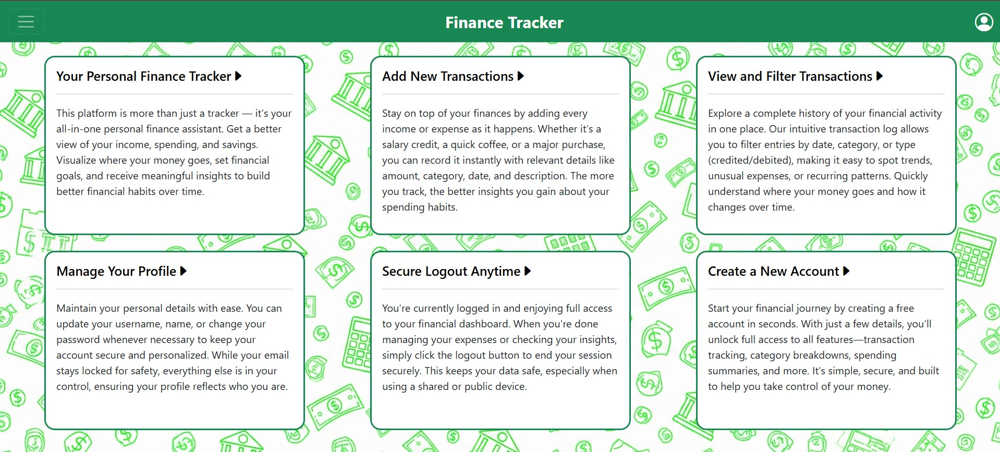

# Personal Finance Tracker

## Overview



My project is a **Personal Finance Tracker**, built using Django and JavaScript. It's a web app that can be used to manage your income and expenses, track your money spent in different categories, and view your spending visually with charts.

You can register, log in, update your profile, add transactions, and view everything in one place. It also has a dashboard that shows spending and saving by category in different chart formats like bar and pie. The UI is customised to work on phones too.

The user can make his entries with great detail as many options are provided to them in an interactive UI. These entries can be viewed by classifing them in different categories and it can also be viewed visually in spending and saving charts for better understanding. The transactions can be filtered based on credited/debited and also according to categories. The user can update their profile details after creating their account. The site also works on small screens, I have tested it using dev tools and also on my mobile device.

---

## File Breakdown

Folders and Files:

- `tracker/models.py`: Has the models User and Transaction.
- `tracker/views.py`: Contains the register, login, logout, index, transaction, dashboard and transaction functions.
- `tracker/urls.py`: Holds the url for all the functions.
- `tracker/templates/tracker/`
  - `index.html`: Home screen with quick links to all the sites with description.
  - `login.html` and `register.html`: Pages to create and login with the account.
  - `transaction.html`: Add new transactions with all details and display recent transactions.
  - `dashboard.html`: View all transactions and filter with based on categories and type. Also view it visually in charts.
  - `profile.html`: Update profile details and change password.
- `tracker/static/tracker/`: 
  - `styles.css`: Custom CSS.
  - Images used in the site

---

## How to Run

```bash
# Step 1: Clone the repo
$ git clone <your-repo-url>
$ cd finance

# Step 2: Set up virtual environment
$ python -m venv env
$ source env/bin/activate 

# Step 3: Migrate database
$ python manage.py makemigrations
$ python manage.py migrate

# Step 4: Run the server
$ python manage.py runserver

# In your browser:
Visit: http://127.0.0.1:8000
```

---

## Requirements

```text
Django>=5.0
```

Libraries such as Chart.js and Bootstrap are used via CDN in HTML.

---


